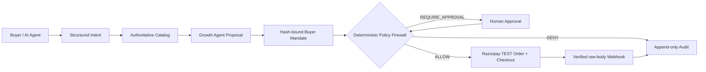

# AGENTREADY

> **Turn any Razorpay merchant into a safe, AI-buyable storefront.**

AGENTREADY is a full-stack agentic-commerce control plane for the Razorpay AI Buildathon, Track 01 — **AI Growth & Agentic Commerce**. It deliberately separates intelligence from authority:

**AI proposes. Authoritative data verifies. Policy authorizes. Razorpay executes. Webhooks confirm. Audit records.**

**Public demo:** https://agentready-beige.vercel.app

## 30-second walkthrough

1. A buyer describes a bounded intent: “sensitive-skin routine under ₹2,000; no fragrance.”
2. The Buyer Agent turns it into constraints and resolves real catalog IDs; the Growth Agent proposes a complementary product but never adds it silently.
3. Before money moves, the server re-reads price/inventory, evaluates a buyer mandate in deterministic code, then either allows, denies, or requires approval.
4. Only an authorized cart can create a server-side Razorpay **TEST Mode** Order. Checkout signature and raw-body webhook verification complete the evidence chain.
5. The Audit Trail and Chaos Lab make every decision—and a blocked price-drift failure—inspectable.

## Product scope and truthful status

The repository ships a polished seeded Demo Merchant experience, deterministic policy engine, ACP-style checkout-session adapter, machine-readable feed, audit hash chain, failure lab, and reproducible offline benchmark. It is deployable without secrets.

Razorpay Orders/Checkout and durable database persistence are **environment-gated**: the UI and `/api/health` explicitly show them as unavailable until credentials are configured. No fake payment, webhook, or revenue claim is made. See [docs/BUILD_STATE.md](docs/BUILD_STATE.md).

## Architecture



### Trust boundary

| Responsibility | AI may do it | Deterministic server code must do it |
|---|---:|---:|
| Extract intent / explain bundle | Yes | Validates output schema |
| Product discovery | Yes | Resolves product IDs from catalog |
| Price, tax, inventory, totals | No | Yes |
| Spend authorization | No | Yes: mandate + policy |
| Razorpay order / checkout | No | Yes, server-side only |
| Signature, idempotency, transitions | No | Yes |

## Features

- Premium responsive command center with clear **synthetic vs. real TEST Mode** labels.
- Authoritative catalog seed with categories, inventory, compatibility and subscription eligibility; raw [catalog feed](/api/catalog/feed).
- Buyer Agent developer trace, Growth Agent proposal, proposed/authorized/executed cart distinctions.
- Deterministic controls: max spend, category allowlist, quantity cap, expiry, approval threshold, inventory freshness, price drift, duplicate execution.
- Hash-bound mandate and append-only SHA-256 audit-chain primitives.
- Explicit finite-state commerce transition guard.
- Razorpay TEST Mode adapter: Orders, Checkout signature utility, HMAC-SHA256 raw webhook verification, replay protection.
- ACP implementation profile: versioned checkout sessions, request IDs, idempotency and lifecycle endpoints; no claim of certification.
- Protocol Lab, Judge Mode, Audit Trail, and one-click Price Drift Chaos Lab.
- Fixed-seed offline evaluation generated into `evaluation/results.json`.

## Razorpay integration

The integration is intentionally TEST MODE only. `POST /api/checkout/order` derives the final amount from product IDs on the server, requires `Idempotency-Key`, evaluates policy, and only then calls Razorpay Orders. The browser never supplies an authoritative amount or uses `KEY_SECRET`.

Webhook endpoint: `POST /api/webhooks/razorpay`

- reads the unmodified raw request body;
- validates `X-Razorpay-Signature` using HMAC SHA-256 and `RAZORPAY_WEBHOOK_SECRET`;
- deduplicates the body hash before handling;
- rejects bad signatures with `401`.

For standard Checkout, client completion is only a UX signal. Server verification and Razorpay’s webhook are the source of final state. Reference: [Razorpay webhooks](https://razorpay.com/docs/webhooks/).

## Protocols

**ACP.** The adapter follows the current stable ACP checkout-session shape at `/api/acp/checkout_sessions`: create, retrieve, update, complete, cancel, version header, request ID and idempotency. ACP remains beta; AGENTREADY labels this implementation as an **ACP implementation profile**, not a certification. See [docs/ACP.md](docs/ACP.md) and the [official ACP repository](https://github.com/agentic-commerce-protocol/agentic-commerce-protocol).

**AP2.** A canonical intent/mandate hash is linked to policy and payment evidence, inspired by AP2’s Checkout Mandate / Receipt model. This is **AP2 compatibility concept only**, not official certification. [AP2 specification](https://github.com/google-agentic-commerce/AP2/blob/main/docs/ap2/specification.md).

**MCP.** The safe tool surface is specified in [docs/ACP.md](docs/ACP.md); an external MCP server must call the same policy-gated APIs and cannot obtain arbitrary payment capability. **x402/UAP:** neither is treated as Razorpay settlement; UAP is not claimed as implemented due to insufficient public specification reviewed for this submission.

## Growth evaluation

`npm run benchmark` evaluates 500 synthetic, fixed-seed (`20260219`) sessions. Both baseline and treatment use the same buyer population. The treatment adds only compatible, budget-fitting proposals; simulated acceptance is a documented utility model—not self-reported revenue.

Current generated result: baseline GMV **₹3,68,600**, AgentReady GMV **₹4,15,924**, incremental simulated GMV **₹47,324 (+12.8%)**, attach rate **15.2%**, budget/policy violations **0.0%**. Full methodology: [docs/EVALUATION.md](docs/EVALUATION.md).

## Failure demo

Run **Chaos Lab → Run price drift demo**. An approved ₹1,799 cart changes to ₹2,049 before execution against a ₹2,000 mandate. Re-verification returns `DENY` with `PRICE_CHANGED` and `BUDGET_EXCEEDED`; no Razorpay Order is created. More: [docs/FAILURE_HANDLING.md](docs/FAILURE_HANDLING.md).

## Local setup

```bash
cp .env.example .env.local
npm install
npm run dev
```

The demo works without credentials. Add TEST credentials only to unlock actual Razorpay calls. Do not add live keys or commit `.env.local`.

## Environment variables

| Variable | Required for | Exposure |
|---|---|---|
| `RAZORPAY_KEY_ID` | TEST Orders | Server only (test key ID may be selectively returned for Checkout) |
| `RAZORPAY_KEY_SECRET` | Orders/signature validation | Server only |
| `RAZORPAY_WEBHOOK_SECRET` | Webhook HMAC | Server only |
| `DATABASE_URL` | Durable persistence | Server only |
| `OPENAI_API_KEY` | Hosted structured AI | Server only |
| `NEXT_PUBLIC_APP_URL` | Absolute callback URLs | Public |

## Commands and testing

```bash
npm run typecheck             # strict TypeScript
npm test                      # pure safety tests, mocked integrations
npm run benchmark             # deterministic offline artifact
npm run build                 # CI / Vercel build
```

Tests cover policy decisions, price drift, approval thresholds, transitions, audit tampering, deterministic evaluation and raw-body webhook verification. External Razorpay APIs are not required for normal CI.

## API surface

| Endpoint | Purpose |
|---|---|
| `GET /api/health` | Non-secret readiness state |
| `GET /api/catalog/feed` | Agent-readable catalog |
| `POST /api/checkout/order` | Policy-gated Razorpay TEST Order |
| `POST /api/webhooks/razorpay` | Verified, idempotent Razorpay event intake |
| `POST /api/acp/checkout_sessions` | ACP-profile create session |
| `GET/PATCH /api/acp/checkout_sessions/:id` | Retrieve/update session |
| `POST /api/acp/checkout_sessions/:id/complete` | Policy-gated completion |
| `POST /api/acp/checkout_sessions/:id/cancel` | Cancel session |

Example ACP create request:

```json
{
  "line_items": [{ "product_id": "p_cleanser", "quantity": 1 }],
  "proposed_total_paise": 59900,
  "mandate": { "id": "mandate_01", "merchantId": "m_demo", "maxAmountPaise": 200000, "categories": ["skincare"], "maxQuantity": 5, "expiresAt": "2030-01-01T00:00:00.000Z", "recurringAllowed": false, "approvalThresholdPaise": 100000, "canonicalHash": "sha256-value" }
}
```

## Repository guide

```text
src/app/api/       versioned adapters and secure routes
src/lib/           policy, state machine, audit, catalog, Razorpay boundary
src/components/    shared product UI
evaluation/        generated offline benchmark artifact
docs/              architecture, security, protocol, demo and pitch material
```

Read [Architecture](docs/ARCHITECTURE.md), [Security](docs/SECURITY.md), [Demo Script](docs/DEMO_SCRIPT.md), and [Pitch](docs/PITCH.md) for judging.

## Limitations and next steps

- The seeded deployment intentionally uses demo-memory state until a managed Postgres URL is configured; Vercel function memory is not durable.
- Hosted LLM structured output is provider-gated. The current demo’s intent path is deterministic, preventing unavailable credentials from being misrepresented as AI execution.
- Razorpay subscriptions, payment links, invoices and refunds are intentionally not faked. They will be enabled only after account capability and TEST credentials are verified.
- No claim of ACP/AP2 certification, UAP compliance, x402 settlement, or live payment processing is made.

## License

MIT. See [LICENSE](LICENSE).
