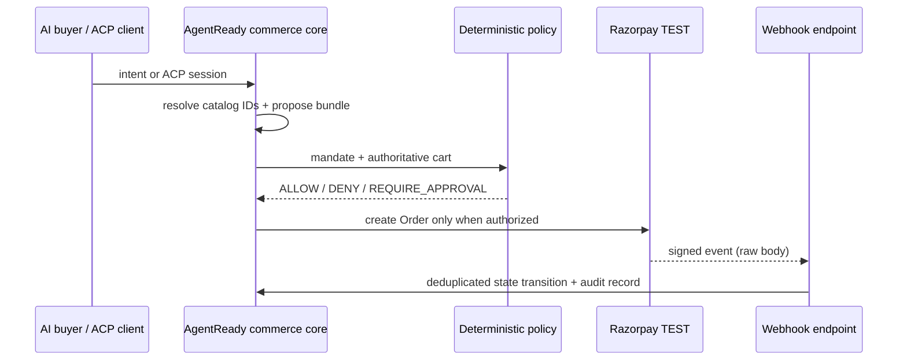

# Architecture

AGENTREADY is a commerce control plane, not an LLM with payment credentials. The buyer-facing agent and merchant-side Growth Agent may propose structured actions. A server-side domain layer re-resolves every product ID against authoritative catalog data, recomputes integer-paise totals, validates mandate bounds, then gates Razorpay execution.

## State machine

`INTENT_RECEIVED → CATALOG_SEARCHED → CART_PROPOSED → GROWTH_OPTIMIZED → PRICE_VERIFIED → POLICY_EVALUATED → AWAITING_APPROVAL|AUTHORIZED → RAZORPAY_ORDER_CREATED → CHECKOUT_PENDING → PAYMENT_AUTHORIZED → PAYMENT_CAPTURED → ORDER_CONFIRMED → FULFILLMENT_PENDING → COMPLETED`.

Terminal safety branches are `POLICY_BLOCKED`, `CANCELLED`, `EXPIRED`, and `PAYMENT_FAILED`. Invalid jumps throw before state is persisted.

## Data model for durable deployment

The production migration target is Postgres: `merchant`, `product`, `agent_session`, `buyer_intent`, `cart`, `cart_item`, `mandate`, `policy_evaluation`, `checkout_session`, `commerce_order`, `razorpay_entity`, `webhook_event`, `approval`, `audit_event`, `benchmark_run`, and `benchmark_session`. Index checkout IDs, Razorpay IDs, event hashes, idempotency keys and `(merchant_id, created_at)`.

Demo-memory mode exists only to make the seeded experience inspectable without a database credential. It is explicitly surfaced by `/api/health` and is not production durable.
