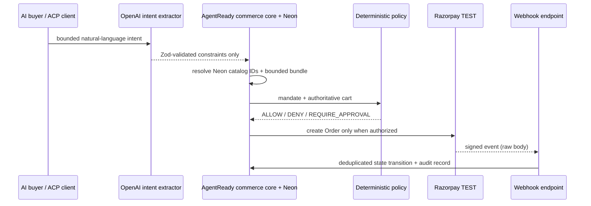

# Architecture

AGENTREADY is a commerce control plane, not an LLM with payment credentials. The buyer-facing agent and merchant-side Growth Agent may propose structured actions. A server-side domain layer re-resolves every product ID against authoritative catalog data, recomputes integer-paise totals, validates mandate bounds, then gates Razorpay execution.

## State machine

`INTENT_RECEIVED → CATALOG_SEARCHED → CART_PROPOSED → GROWTH_OPTIMIZED → PRICE_VERIFIED → POLICY_EVALUATED → AWAITING_APPROVAL|AUTHORIZED → RAZORPAY_ORDER_CREATED → CHECKOUT_PENDING → PAYMENT_AUTHORIZED → PAYMENT_CAPTURED → ORDER_CONFIRMED → FULFILLMENT_PENDING → COMPLETED`.

Terminal safety branches are `POLICY_BLOCKED`, `CANCELLED`, `EXPIRED`, and `PAYMENT_FAILED`. Invalid jumps throw before state is persisted.

## Data model

Production uses Neon Postgres through Drizzle. Implemented tables are `merchants`, `products`, `agent_sessions`, `mandates`, `checkout_sessions`, `commerce_orders`, `idempotency_records`, `webhook_events`, `audit_events`, and `benchmark_runs`. Unique indexes protect merchant SKU, checkout/idempotency keys, Razorpay IDs, webhook hashes and audit hashes. ACP lifecycle calls and web checkout share these tables.

If `DATABASE_URL` is omitted locally, read-only catalog/planning code can use the source-controlled seed. Money execution is intended for the durable deployed path.
